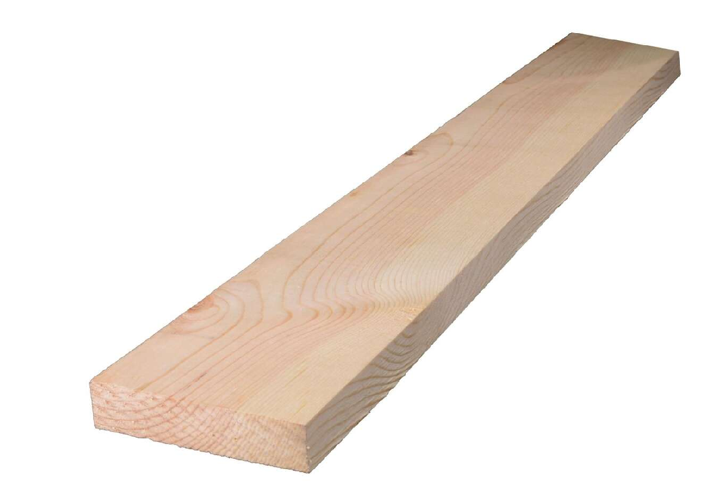

# [The Network](https://github.com/LafeLabs/network)

*everything replicates!*

 - [index.html](index.html)
 - [MUSIC/](music/)
 - [STONE SOUP/](stonesoup/)
 - [BRACKETS/](brackets/)
 - [TERMINAL/](terminal/)
 - [PODCASTS/](podcasts/)
 - [BOOKS/](books/)
 - [ZINES/](zines/)
 - [Fashion/](fashion/)
 - [Freestore/](freestore/)
 - [Laws of the Network/](laws/)
 - [DIRT PIPE/](dirtpipe/)
 - [INTERNET OF SQUARES/](squares/)
 - [write on the wall](wall.html)
 - [page/](page/)
 - [QR Code](qrcode.html)
 - [STREET NETWORK/](street/)
 - [WATERSHED NETWORK](watershed/)
 - [WHAT CAN I DO FOR THE NETWORK?/](network-actions/)
 - [WHAT CAN THE NETWORK DO FOR ME?](network-benefits/)
 - [fork.html](fork.html)

1. Get a 8 foot 1x4.
2. Cut off two sections each 24 inches long
3. Cut off a section 28 inches long
4. print out the screen bracket
5. print out the board bracket
6. print out 4 of the flat bracket
6. print out the pi bracket and add M2.5 thread inserts
7. print out the circuit playground bracket and add 4-40 thread inserts
8. drill all the holes in all the boards
9. assemble all the screws

