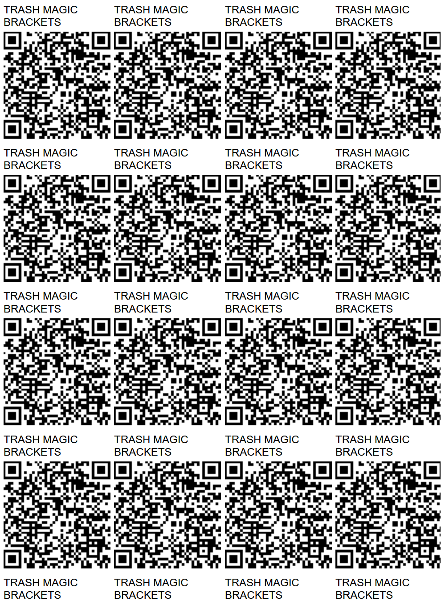
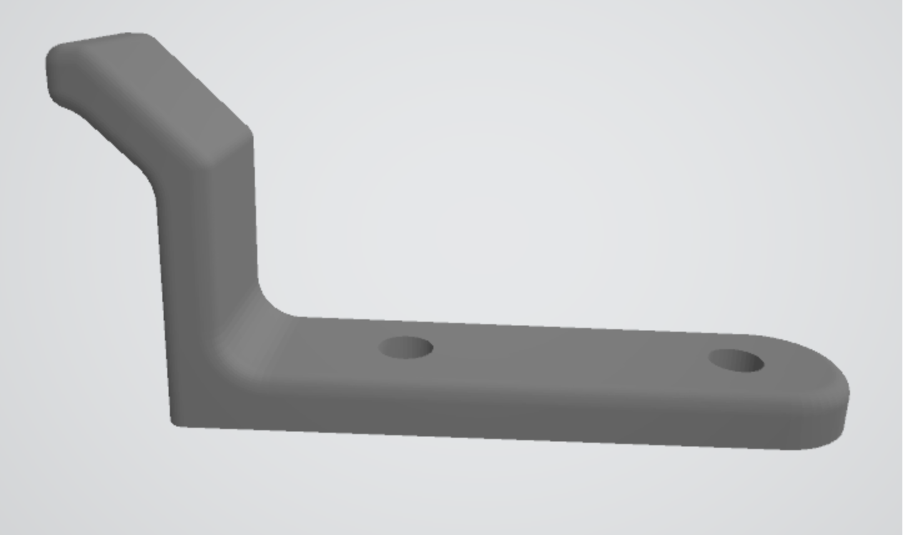
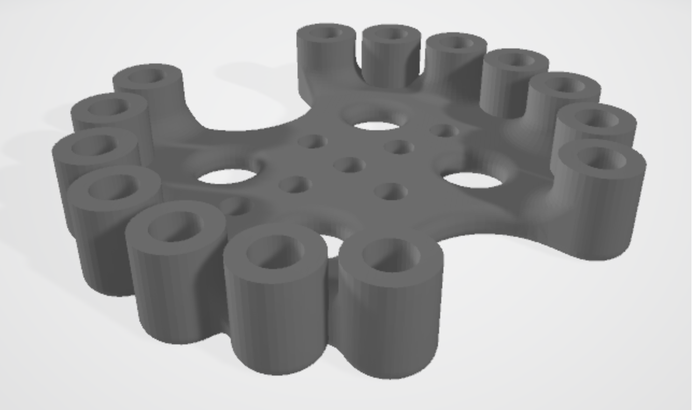
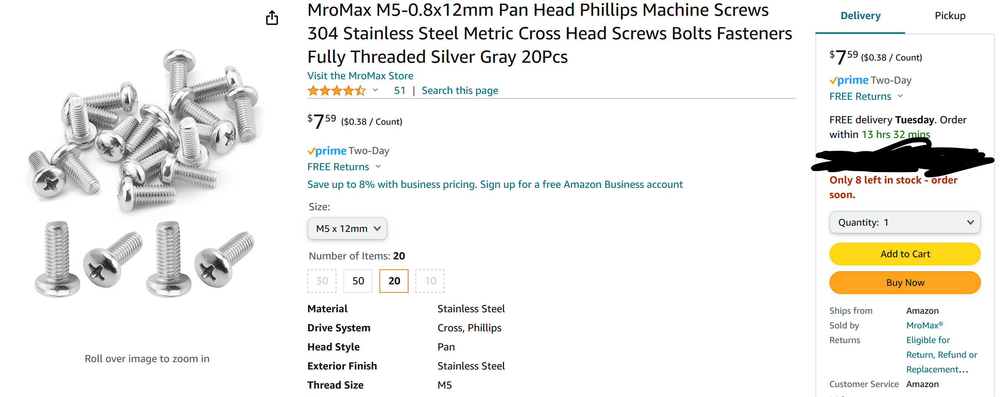
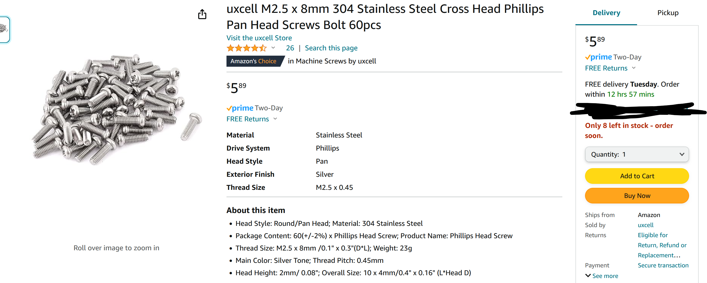
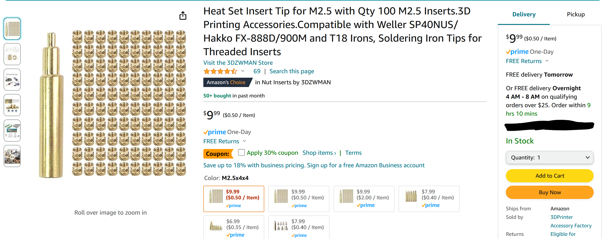

## [Up A Level](../)

# [Brackets](https://github.com/LafeLabs/network/tree/main/brackets)




```
sudo wget https://raw.githubusercontent.com/LafeLabs/network/main/brackets/replicator.sh -O replicator.sh
sudo sh replicator.sh
```

[](elements/arduino-bracket.STL)

[](elements/cable-cleat.STL)

[](elements/circuit-playground-express-wood-bracket.STL)

[](elements/pi4-wood-bracket.STL)

[](elements/stemma-knob-wood-bracket.STL)

[](elements/sunfounder-screen-wood-bracket.STL)


 - [DIRT WIZARD ON TIKTOK](https://www.tiktok.com/@dirt_wizard666)
 - [DIRT WIZARD ON CYBERPUNK.LOL](https://cyberpunk.lol/@dirtwizard)
 - [DIRT WIZARD ON SHARKEY](https://shark.distantserver.org/@dirtwizard)
 - [DIRT WIZARD ON GITHUB](https://github.com/lafeLabs/)

## 1/2 inch #4 wood screws

[](https://www.amazon.com/gp/product/B0B4SKDPDR/)

## M5 Screws for Sunfounder Screen bracket

[](https://www.amazon.com/gp/product/B07YHRQWPX/)

## M2.5 Screws for Raspberry Pi bracket and Stemma knob bracket

[](https://www.amazon.com/dp/B012TE3LDM)

## M2.5 Thread Inserts

[](https://www.amazon.com/dp/B0BBSH26TD)


## 4-40 Screws for Arduino UNO and Circuit Playground Express

[](https://www.amazon.com/dp/B07ZHBXG57)

## 4-40 Thread Inserts

[](https://www.amazon.com/dp/B0CG4M8HC5)

## Thread insert tool 

[](https://www.amazon.com/dp/B0BBSGG2S2)

## AnkerMake 3d printer

[](https://www.amazon.com/dp/B0CT5YMGC9)


