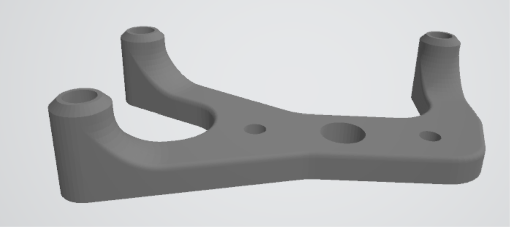
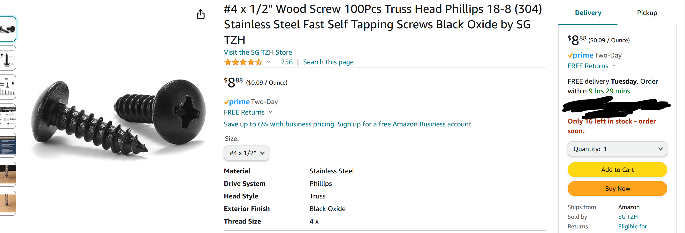
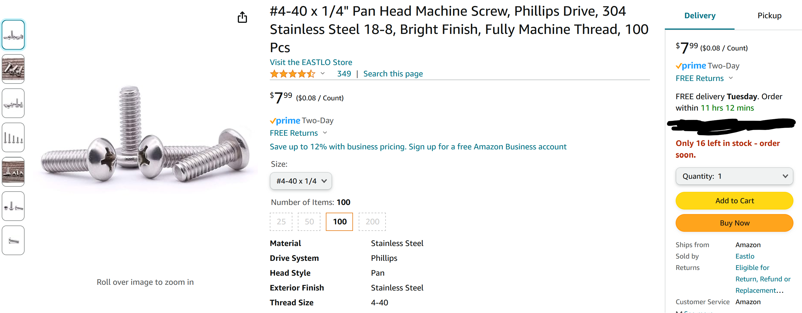
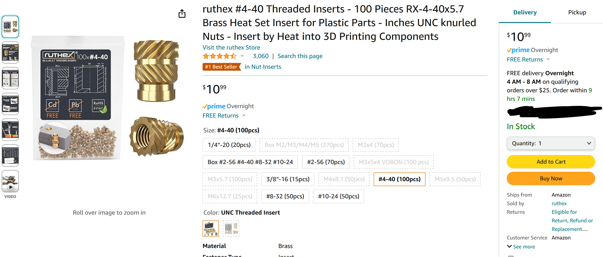
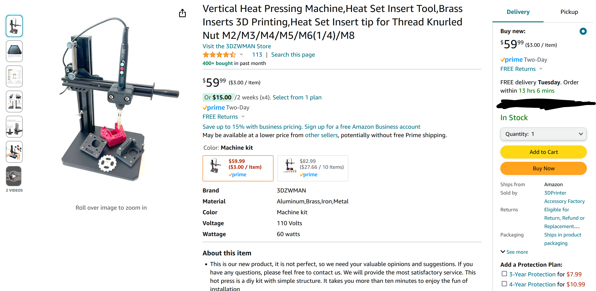
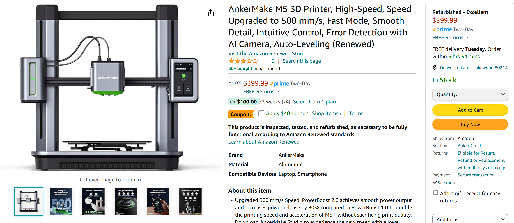

## [Up A Level](../)

# [DIRT PIPE](https://github.com/LafeLabs/network/tree/main/dirtpipe)


[link to the circuit boards on pcbway.com](https://www.pcbway.com/project/shareproject/W224521BSI51_dirtpipe_UNO_shield_v1_2024_04_04_8aeaeaa8.html)

[](elements/arduino-bracket.STL)

[digikey cart with all the parts other than headers](https://www.digikey.com/short/bcr3z21v)

[headers on amazon](https://www.amazon.com/Header-Lystaii-Pin-Connector-Electronic/dp/B06ZZN8L9S/)


## 1/2 inch #4 wood screws

[](https://www.amazon.com/gp/product/B0B4SKDPDR/)

## 4-40 Screws for Arduino UNO and Circuit Playground Express

[](https://www.amazon.com/dp/B07ZHBXG57)

## 4-40 Thread Inserts

[](https://www.amazon.com/dp/B0CG4M8HC5)

## Thread insert tool 

[](https://www.amazon.com/dp/B0BBSGG2S2)

## AnkerMake 3d printer

[](https://www.amazon.com/dp/B0CT5YMGC9)


```
#include <Adafruit_NeoPixel.h>
#ifdef __AVR__
#endif

// Which pin on the Arduino is connected to the NeoPixels?
#define PIN 12 // On Trinket or Gemma, suggest changing this to 1

// How many NeoPixels are attached to the Arduino?
#define NUMPIXELS 8 // 
//there are 8

// When setting up the NeoPixel library, we tell it how many pixels,  
// and which pin to use to send signals. Note that for older NeoPixel
// strips you might need to change the third parameter -- see the
// strandtest example for more information on possible values.
Adafruit_NeoPixel pixels(NUMPIXELS, PIN, NEO_GRB + NEO_KHZ800);


int buttons0 = 0;
int buttons1 = 0;
int buttons0_2 = 0;
int buttons1_2 = 0;
int buttonmode0 = 0;
int buttonmode1 = 0;

int modevoltage1 = 110;
int modevoltage2 = 215;
int modevoltage3 = 320;
int modevoltage4 = 425;
int modevoltage5 = 542;
int modevoltage6 = 670;
int modevoltage7 = 820;

int delta =  20;

int knob = 0;
boolean on = false;
boolean test = false;


#include <MozziGuts.h>
#include <Oscil.h> // oscillator template
#include <tables/sin2048_int8.h> // sine table for oscillator

// use: Oscil <table_size, update_rate> oscilName (wavetable), look in .h file of table #included above
Oscil <SIN2048_NUM_CELLS, AUDIO_RATE> aSin(SIN2048_DATA);

// use #define for CONTROL_RATE, not a constant
#define CONTROL_RATE 64 // Hz, powers of 2 are most reliable


void setup() {
    Serial.begin(115200);
    knob = analogRead(A3);
    buttons0 = analogRead(A0);
    buttons1 = analogRead(A1);
    pinMode(15,INPUT_PULLUP);
    pinMode(16,INPUT_PULLUP);
    pixels.begin(); // INITIALIZE NeoPixel strip object (REQUIRED)
    startMozzi(CONTROL_RATE); // :)
    aSin.setFreq(2600); // set the freq to knob in Hz
    pinMode(9,OUTPUT); 

}
void updateControl(){
  // put changing controls in here
}


AudioOutput_t updateAudio(){
  return MonoOutput::from8Bit(aSin.next()); // return an int signal centred around 0
}


void loop() {

  buttons0 = analogRead(A0);
  buttons1 = analogRead(A4);
  //delay(30);
  buttons0_2 = analogRead(A0);
  buttons1_2 = analogRead(A4);

  knob = analogRead(A3);
  on = !digitalRead(15);
  test = !digitalRead(16);

  if(buttons0 <  delta && buttons0_2 < delta){
    buttonmode0 = 0;
  }
  if(buttons0 > modevoltage1 - delta && buttons0 < modevoltage1 + delta && buttons0_2 > modevoltage1 - delta && buttons0_2 < modevoltage1 + delta){
    buttonmode0 = 1;
  }
  if(buttons0 > modevoltage2 - delta && buttons0 < modevoltage2 + delta && buttons0_2 > modevoltage2 - delta && buttons0_2 < modevoltage2 + delta){
    buttonmode0 = 2;
  }
  if(buttons0 > modevoltage3 - delta && buttons0 < modevoltage3 + delta && buttons0_2 > modevoltage3 - delta && buttons0_2 < modevoltage3 + delta){
    buttonmode0 = 3;
  }
  if(buttons0 > modevoltage4 - delta && buttons0 < modevoltage4 + delta && buttons0_2 > modevoltage4 - delta && buttons0_2 < modevoltage4 + delta){
    buttonmode0 = 4;
  }
  if(buttons0 > modevoltage5 - delta && buttons0 < modevoltage5 + delta && buttons0_2 > modevoltage5 - delta && buttons0_2 < modevoltage5 + delta){
    buttonmode0 = 5;
  }
  if(buttons0 > modevoltage6 - delta && buttons0 < modevoltage6 + delta && buttons0_2 > modevoltage6 - delta && buttons0_2 < modevoltage6 + delta){
    buttonmode0 = 6;
  }
  if(buttons0 > modevoltage7 - delta && buttons0 < modevoltage7 + delta && buttons0_2 > modevoltage7 - delta && buttons0_2 < modevoltage7 + delta){
    buttonmode0 = 7;
  }
  if(buttons0 > 1024 - delta && buttons0_2 > 1024 - delta){
    buttonmode0 = 8;
  }

  if(buttons1 <  delta && buttons1_2 < delta){
    buttonmode1 = 0;
  }
  if(buttons1 > modevoltage1 - delta && buttons1 < modevoltage1 + delta && buttons1_2 > modevoltage1 - delta && buttons1_2 < modevoltage1 + delta){
    buttonmode1 = 1;
  }
  if(buttons1 > modevoltage2 - delta && buttons1 < modevoltage2 + delta && buttons1_2 > modevoltage2 - delta && buttons1_2 < modevoltage2 + delta){
    buttonmode1 = 2;
  }
  if(buttons1 > modevoltage3 - delta && buttons1 < modevoltage3 + delta && buttons1_2 > modevoltage3 - delta && buttons1_2 < modevoltage3 + delta){
    buttonmode1 = 3;
  }
  if(buttons1 > modevoltage4 - delta && buttons1 < modevoltage4 + delta && buttons1_2 > modevoltage4 - delta && buttons1_2 < modevoltage4 + delta){
    buttonmode1 = 4;
  }
  if(buttons1 > modevoltage5 - delta && buttons1 < modevoltage5 + delta && buttons1_2 > modevoltage5 - delta && buttons1_2 < modevoltage5 + delta){
    buttonmode1 = 5;
  }
  if(buttons1 > modevoltage6 - delta && buttons1 < modevoltage6 + delta && buttons1_2 > modevoltage6 - delta && buttons1_2 < modevoltage6 + delta){
    buttonmode1 = 6;
  }
  if(buttons1 > modevoltage7 - delta && buttons1 < modevoltage7 + delta && buttons1_2 > modevoltage7 - delta && buttons1_2 < modevoltage7 + delta){
    buttonmode1 = 7;
  }
  if(buttons1 > 1024 - delta && buttons1_2 > 1024 - delta){
    buttonmode1 = 8;
  }

   if(buttonmode0 == 0 && buttonmode1 == 0){
    pixels.setPixelColor(0, pixels.Color(0, 0, 0));    
    pixels.setPixelColor(1, pixels.Color(0, 0, 0));    
    pixels.setPixelColor(2, pixels.Color(0, 0, 0));    
    pixels.setPixelColor(3, pixels.Color(0, 0, 0));    
    pixels.setPixelColor(4, pixels.Color(0, 0, 0));    
    pixels.setPixelColor(5, pixels.Color(0, 0, 0));    
    pixels.setPixelColor(6, pixels.Color(0, 0, 0));    
    pixels.setPixelColor(7, pixels.Color(0, 0, 0));     
   }
   if(buttonmode0 !=0 && buttonmode0 == buttonmode1){
    pixels.setPixelColor(0, pixels.Color(0, 0, 0));    
    pixels.setPixelColor(1, pixels.Color(0, 0, 0));    
    pixels.setPixelColor(2, pixels.Color(0, 0, 0));    
    pixels.setPixelColor(3, pixels.Color(0, 0, 0));    
    pixels.setPixelColor(4, pixels.Color(0, 0, 0));    
    pixels.setPixelColor(5, pixels.Color(0, 0, 0));    
    pixels.setPixelColor(6, pixels.Color(0, 0, 0));    
    pixels.setPixelColor(7, pixels.Color(0, 0, 0));     
    pixels.setPixelColor(buttonmode0 - 1, pixels.Color(200, 0, 200));        //purple
   }
   if(buttonmode0 !=0 && buttonmode0 != buttonmode1){
    pixels.setPixelColor(0, pixels.Color(0, 0, 0));    
    pixels.setPixelColor(1, pixels.Color(0, 0, 0));    
    pixels.setPixelColor(2, pixels.Color(0, 0, 0));    
    pixels.setPixelColor(3, pixels.Color(0, 0, 0));    
    pixels.setPixelColor(4, pixels.Color(0, 0, 0));    
    pixels.setPixelColor(5, pixels.Color(0, 0, 0));    
    pixels.setPixelColor(6, pixels.Color(0, 0, 0));    
    pixels.setPixelColor(7, pixels.Color(0, 0, 0));     
    pixels.setPixelColor(buttonmode0 - 1, pixels.Color(200, 0,0));        //red
    pixels.setPixelColor(buttonmode1 - 1, pixels.Color(0, 0,200));        //blue

   }
   if(buttonmode0 !=0 && buttonmode1 == 0){
    pixels.setPixelColor(0, pixels.Color(0, 0, 0));    
    pixels.setPixelColor(1, pixels.Color(0, 0, 0));    
    pixels.setPixelColor(2, pixels.Color(0, 0, 0));    
    pixels.setPixelColor(3, pixels.Color(0, 0, 0));    
    pixels.setPixelColor(4, pixels.Color(0, 0, 0));    
    pixels.setPixelColor(5, pixels.Color(0, 0, 0));    
    pixels.setPixelColor(6, pixels.Color(0, 0, 0));    
    pixels.setPixelColor(7, pixels.Color(0, 0, 0));     
    pixels.setPixelColor(buttonmode0 - 1, pixels.Color(200, 0,0));        //red

   }

   if(buttonmode1 !=0 && buttonmode0 == 0){
    pixels.setPixelColor(0, pixels.Color(0, 0, 0));    
    pixels.setPixelColor(1, pixels.Color(0, 0, 0));    
    pixels.setPixelColor(2, pixels.Color(0, 0, 0));    
    pixels.setPixelColor(3, pixels.Color(0, 0, 0));    
    pixels.setPixelColor(4, pixels.Color(0, 0, 0));    
    pixels.setPixelColor(5, pixels.Color(0, 0, 0));    
    pixels.setPixelColor(6, pixels.Color(0, 0, 0));    
    pixels.setPixelColor(7, pixels.Color(0, 0, 0));     
    pixels.setPixelColor(buttonmode1 - 1, pixels.Color(0, 0,200));        //blue

   }


  pixels.show();   // Send the updated pixel colors to the hardware.

  aSin.setFreq((buttonmode0+1)*knob);      

/*
  if(on){
  }
  if(!on && !test){
    aSin.setFreq(0);      

  }

*/

audioHook(); // required here

//Serial.println(buttons0);

//Serial.println(buttonmode1);

/*  
  Serial.print(buttons0); 
  Serial.print(",");   
  Serial.print(buttons1); 
  Serial.print(",");   
  Serial.println(knob); 

  if(on){
    Serial.println("ON");
  }
  if(test){
    Serial.println("TEST");
  }
  if(!on && !test){
    Serial.println("OFF");
  }
*/
  
}
```

## DIRT PIPE REPLICATOR CODE:

```
sudo wget https://raw.githubusercontent.com/LafeLabs/network/main/dirtpipe/replicator.sh -O replicator.sh
sudo sh replicator.sh
```

## LINKS

 - [editor.php](editor.php)
 - [webeditor.html](webeditor.html)
 - [localhost](http://localhost)
 - [write on the wall](wall.html)
 - [DIRT WIZARD ON TIKTOK](https://www.tiktok.com/@dirt_wizard666)
 - [DIRT WIZARD ON CYBERPUNK.LOL](https://cyberpunk.lol/@dirtwizard)
 - [DIRT WIZARD ON SHARKEY](https://shark.distantserver.org/@dirtwizard)
 - [DIRT WIZARD ON GITHUB](https://github.com/lafeLabs/)
 - [QR Code](qrcode.html)
 - [fork.html](fork.html)


