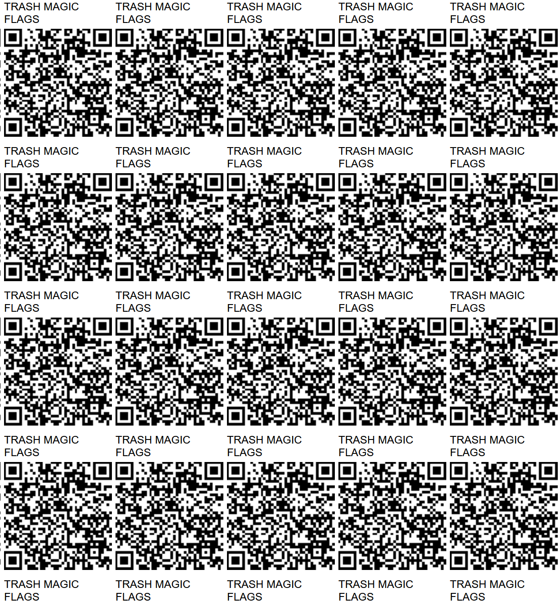
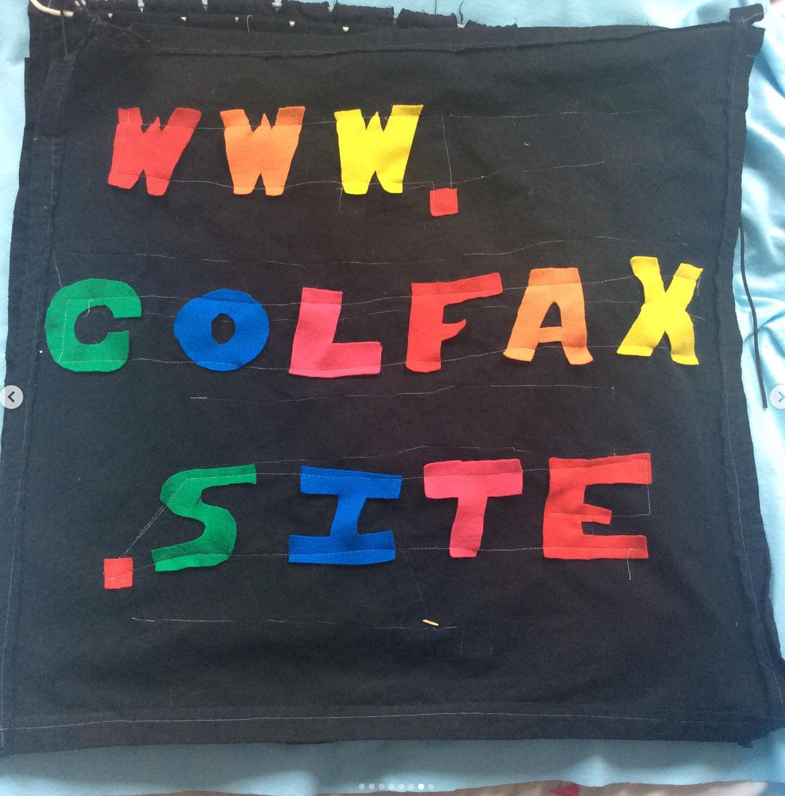
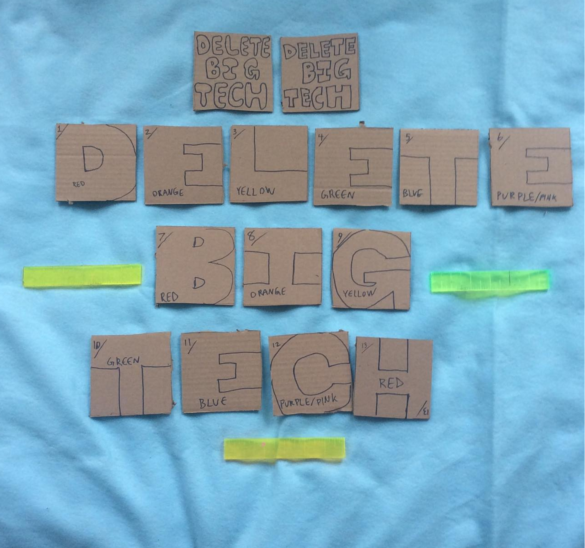
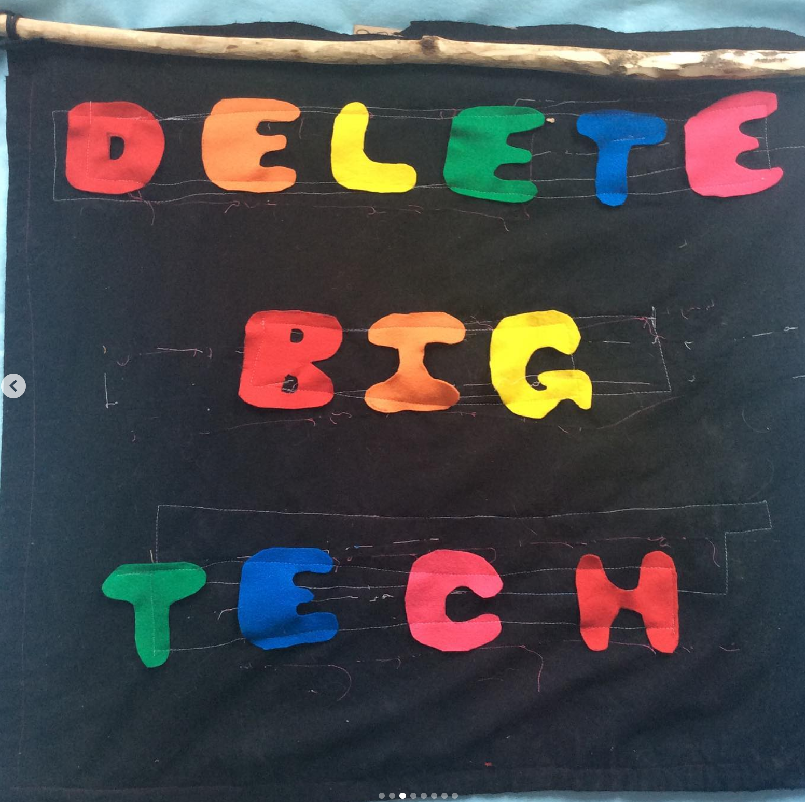
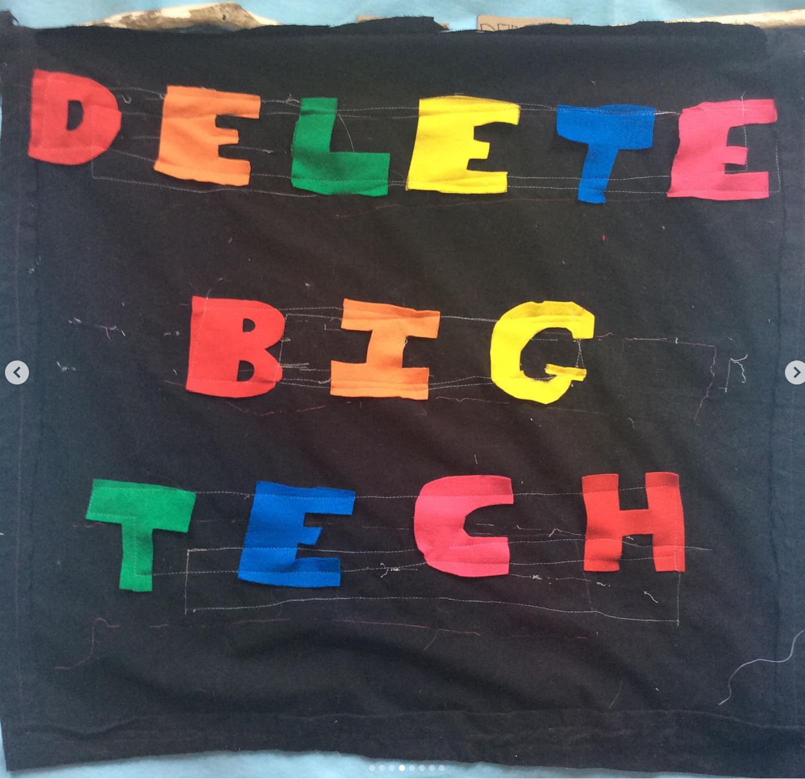
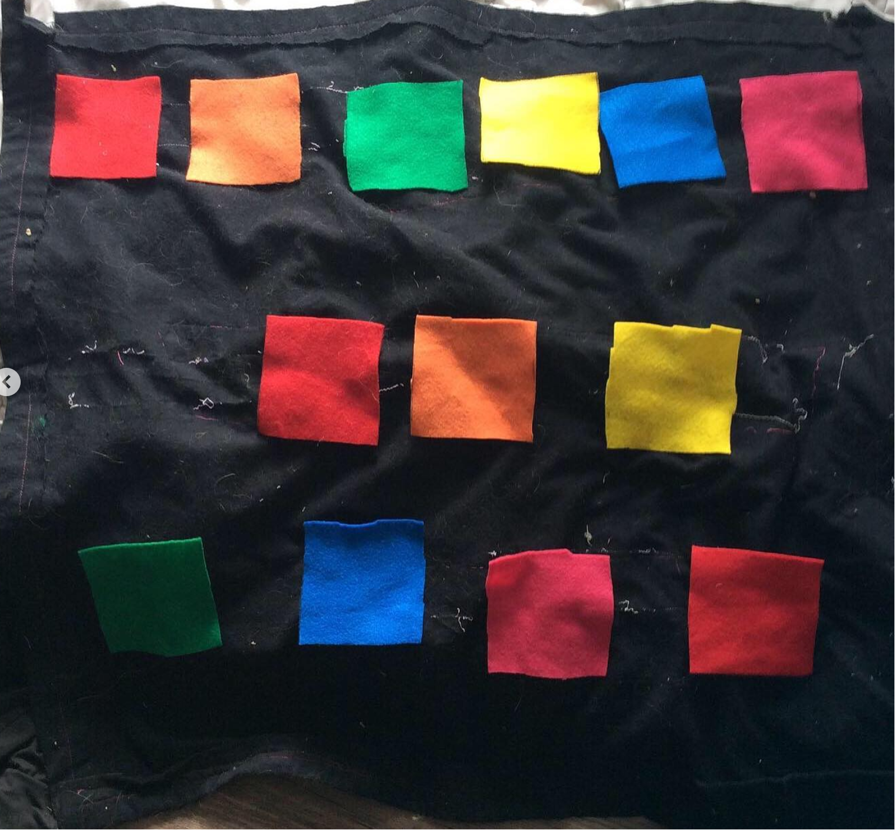
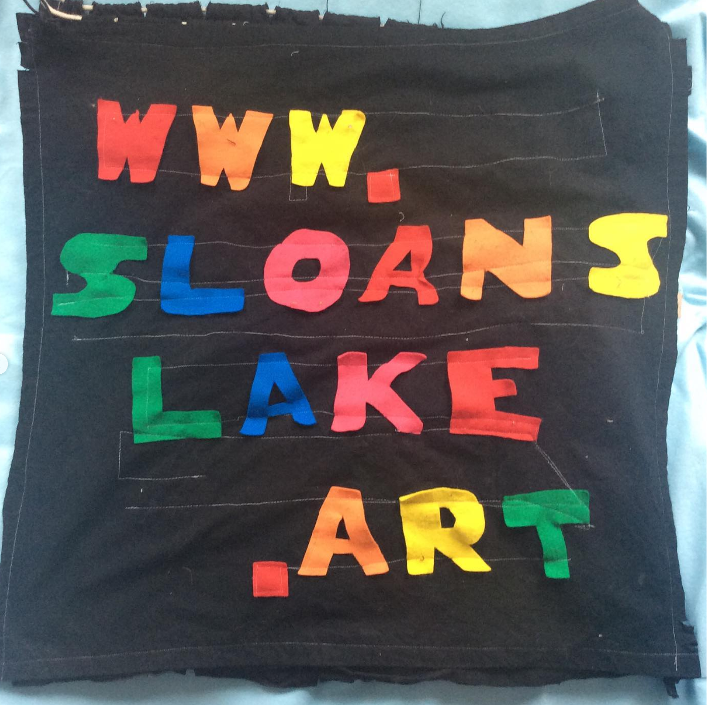
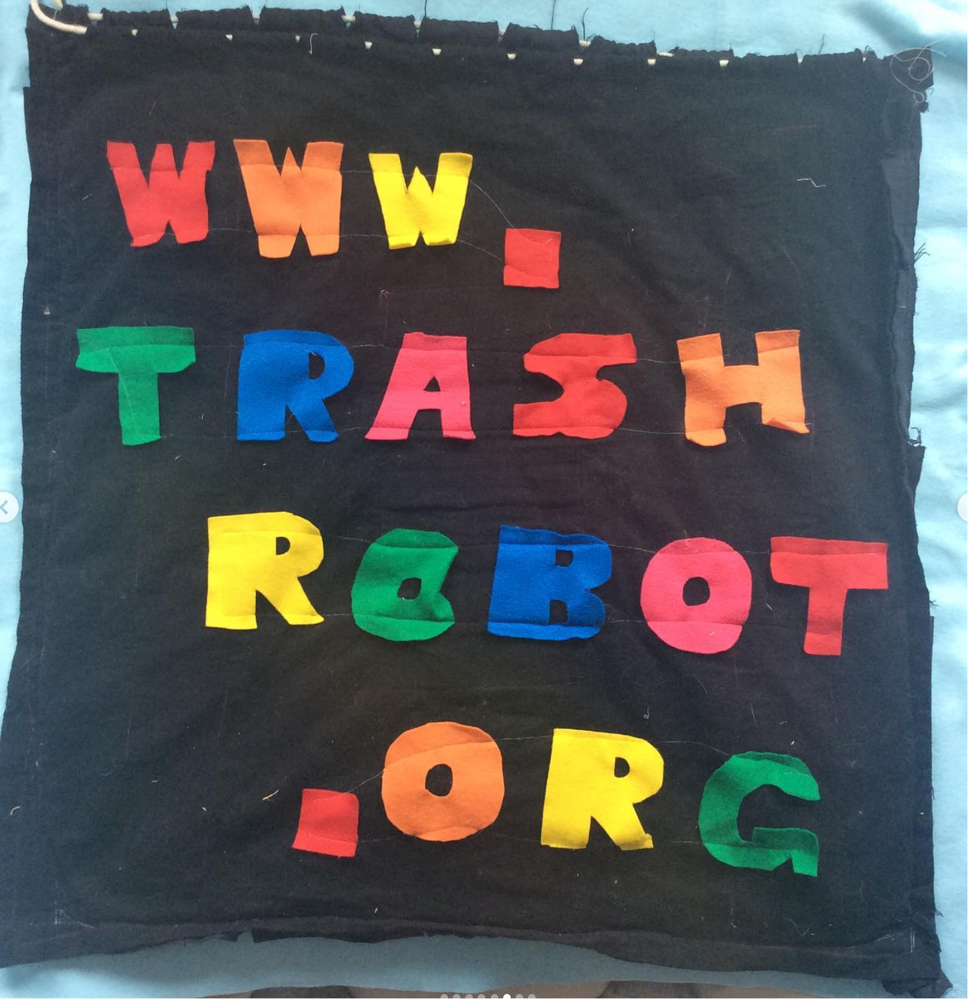

## [Up A Level](../)

# [FLAGS](https://github.com/LafeLabs/network/tree/main/flags)












```
sudo wget https://raw.githubusercontent.com/LafeLabs/network/main/flags/replicator.sh -O replicator.sh
sh replicator.sh
```